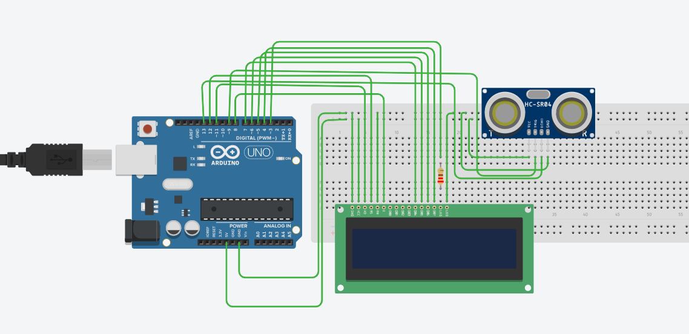

# Ultrasonic Distance Meter 📏

## Components Used
- Arduino Uno
- HC-SR04 Ultrasonic Sensor
- LCD 1602
- Breadboard & jumper wires

## What it does
Measures distance using ultrasonic sound waves
and displays it live on LCD!!

## How it works
- Trig pin fires 40kHz sound pulse
- Echo pin measures reflection time
- Distance = (duration × 0.034) / 2

## What I learned
- Ultrasonic sensor working principle
- pulseIn() function
- Combining multiple components
- LCD display integration
## Circuit

