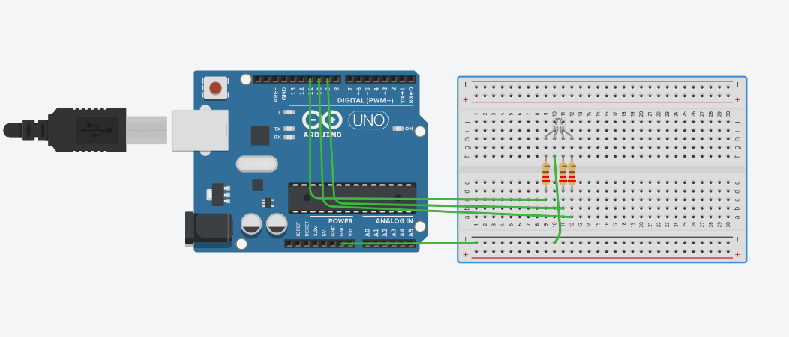

# RGB LED Color Mixer 🎨

## Components Used
- Arduino Uno
- RGB LED (Common Anode)
- 3x 220Ω resistors
- Breadboard & jumper wires

## What it does
Cycles through 7 colors using PWM signals

## What I learned
- PWM pins on Arduino
- Common Anode vs Common Cathode
- Custom functions in C++
- analogWrite() for color mixing

## Circuit
Simulated with Common Cathode in Tinkercad
Real hardware uses Common Anode RGB LED

Note: For Common Anode, invert all values
(255 = OFF, 0 = full brightness)
