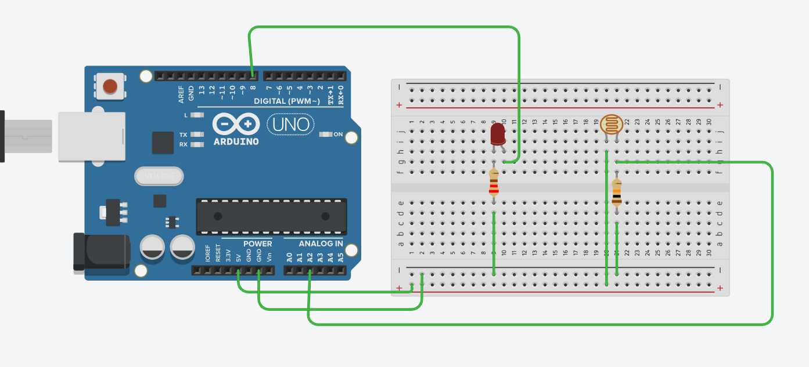

# Automatic Street Light 💡

## Components
- Arduino Uno
- LDR
- LED
- 10kΩ resistor
- 220Ω resistor

## How it works
LDR reads ambient light
Dark  → LED turns ON
Bright → LED turns OFF

## Real world application
Exactly how actual street lights work!!

## What I learned
- LDR and voltage divider
- analogRead()
- Threshold based control
  ## Circuit

